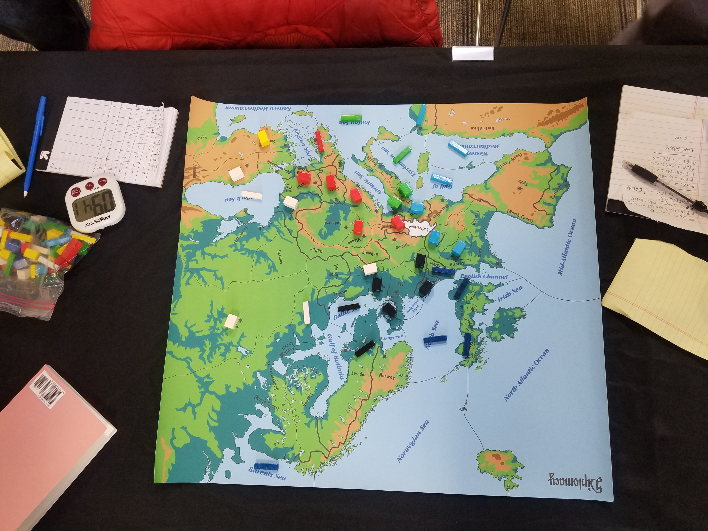

# How to Top the Board

On the Top Board of the 2019 Season of the Minnesota Diplomacy Club, as Austria I was eliminated first, alongside my early-game ally Italy, in 1905.

We had executed well Andrew Goff's 'Modern Borders' concept wherein Italy assumes ownership of Trieste, in 1901. Most of the board thought we were at odds, which worked well in my view given I perceived there to be a target on my back given I'd finished first in the season's standings--earning the coveted Player of the Year title--and had played ruthlessly to attain that position in the season's November and December games. (It would be a tragedy to not only allow me to win Player of the Year, but also to steal the Best Diplomacy Player in Minnesota--congratulations to Zachary Moore for this achievement!)

With Italy in my home center Trieste, I was not, at least, to be an early threat. My suspicion is that this seemingly unfortunate situation for me as Austria was welcomed in that it satisfied an element of revenge that at least two players wished upon me. The subject of Letting Players Have Their Revenge will be studied later in this book. What's more, this game was used a Top Board format, so there would be only one winner, so to over-focus on my demise would be a mistake.

Let me pause to say something about Top Boards, tournament formats, clubs, and scoring systems in general. 

First off, a question: Do _any_ of the debates on these subjects amount to a larger change to the game than the advent of the three-point line in basketball? 

Maybe. Maybe not. That could be worth an essay. 

What I do appreciate, and again I think the passion and quality of the debates suggests widespread love for the game, is a delving into the finer aesthetics, dynamism, and replayability. We wouldn't care to expend so much effort if we didn't love the game. (Let's give a nod to Calhamer as well for leaving the rules on scoring delightfully ambiguous so as to allow the theologian-scholars to debate and for the disc-jockeys to remix for all time.) 

As with fashion in apparel, my gut says there are a lot of less good scoring systems and a few better ones. And, also, I don't think we've exhausted all searches for better ways.

So far, the Minnesota Diplomacy Club uses sum-of-squares. However, I'm for experiments and innovation like the more nuanced Janus, currently being trialed in Chicago, which to my eye maximizes a blend of competence, dominance, survival, and dynamism (reversal of fortunes). It really matters if a new player fights their ass off to survive despite their inevitable new-player blunder.

A word on tournaments. I've only played in one tournament--WeaselMoot XIII, where I placed 5th in a small field--and as such my comments on tournaments are preliminary. 

First off, tournaments are my favorite version of the game of Diplomacy. Most Diplomacy games are frankly too short and don't allow the majesty of the game's design to develop sufficiently. The strategic nuances of the mid-game are the aces of Diplomacy's deck. Even end-games, rarely reached with all players fully engaged, can be, to use a millenial term, super interesting. Furthermore, multiple grind-it-out games showcase mental fortitude and stamina, strategic thinking and execution on multiple levels, and let's be honest, overall mastery. 

While there certainly is variance in a game like Diplomacy, I don't think that its a fluke to see certain players succeed time and again at top tournaments.

For at least the next two years, I'm planning to attend the World Diplomacy Championships, at Carnage in Vermont in 2020 and in Bangkok, Thailand in 2021. And although I might be eliminated simply for daring to think I could write a book on Diplomacy, I greatly look forward to the experience. I've never been to Vermont and every time I'm in Thailand I have a good time.

I began this section by introducing the setting of a recently played Top Board held by the Minnesota Diplomacy Club. 

In a game that seemed to start with a Western Triple, this should have been a good game for Austria. I can laugh at that now despite the disappointment. So as not to make you wait overlong I'll share briefly how the game went for me. (Rest assured we will return to it throughout the book.)

Having established a good AI, France--part of at least an EF if not a Western Triple--came south. Even though this was my moment to work against Russia, I not only took back Trieste (and went for Venice too but waited too long to attack Russia, who beat me to the punch. In the above image you can see a few candidate move-sets like A Tyr - Vie, A Vie - Gal, A Tri - Bud, A Ser - Rum, A Bul S Ser - Rum, F Gre S Bul. 

As Italy--Eric Silverman--quickly pointed out to me, I could have let he and France--Jake Langenfeld--remain locked up in the Med for several years whilst making my single-front Russian campaign. As it was, I calculated that I could take back Triest (in Fall 1903) and make my overrunning of Russia that much more decisive before Germany could get England off his back or France's fleets could make inroads into the Balkans. This calculation missed on several points, the key one being that Italy did not pull the units most advantageous to my board-topping. (I would have played this moment similarly to Eric, under the logic that one cannot allow a player to do this to you without consequences, even if in the moment, Eric's chances to win might have involved staying onside with me despite my stab.)

Overall, I made the wrong play and soon after the wrong read with regard to the remaining player with whom I was good terms, Zachary Moore's Russia. By this point I was clearly again a threat, albeit on only six centers--Austria can grow fast--and Zachary put enough doubt in my mind so as to not defend against his stab...and did so a year before I was setting up my own. Well played to Zach!

As the game progressed I collaborated with Italy and Turkey to reestablish Turkey with three home centers, and to my eye the game ended slightly prematurely with a draw vote which made Zachary Moore's Russia the winner (10-10-9 with France and England but winning the tiebreak having chosen last under the Paris Method) and the title of Best Diplomacy Player in Minnesota for 2019. The way I saw it at that point, each of Jake Langenfeld (France), Paul Manning (England)--despite a 1901 misorder, and Zachary Moore (Russia) were deserving winners and might have fought it out, especially with Turkey being back on three centers. To me, it felt like Zach wanted to win just a little bit more and persuaded them he would win the fight. Or maybe they persuaded themselves against the fight seeing as time was at our venue, unfortunately, short. 

You might check the title of this section, scratch your head, and wonder why I've titled it so, but then you wouldn't really have an answer, except that in by doing an After Action Report, anyone can reverse-engineer their way to a board top. 
